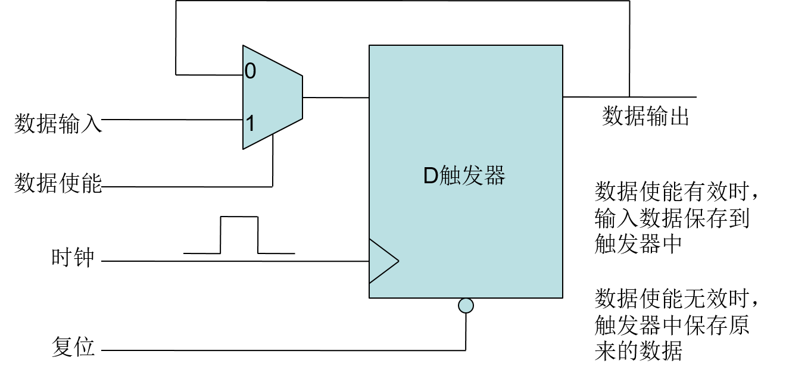

# Lab02 寄存器文件

> PB15000102 王嵩超

## 实验原理

寄存器如何存储数据：



## 实验目的与要求

设计一32*32bit的寄存器文件，即32个32位的寄存器文件（寄存器组）

- 具备两组读端口及一组写端口
- 通过读端口可从0~31号的任意地址读取数据
- 通过写端口可向0~31号的任意地址写入数据
- 寄存器的复位值自行制定

### 寄存器接口

我使用了供参考的接口设计：

```verilog
module REG_FILE(
input			      clk,
input			      rst_n,
input	[4:0]	      r1_addr,
input	[4:0]	      r2_addr,
input	[4:0]	      r3_addr,
input	[31:0]        r3_din,
input			      r3_wr,
output [31:0]	       r1_dout,
output  [31:0]	       r2_dout
);
```

###功能要求

**<u>调用实验一ALU</u>**，完成以下功能：

- 寄存器文件组r0,r1初始化为1，1，其他所有寄存器初始化为0
- 在clk控制下，依次完成以下计算，注意每个clk至多允许完成一次计算

> 为了与计算机内CPU的构造类似，所有的寄存器输入值都应由ALU计算而获得。如置零可用类似xor \$ax, \$ax的方法完成。

## 实验设计

设计一个顶层模块Top

- 在Top中调用ALU完成加法运算
- 在Top中调用REG_FILE完成数据存取
- 在Top中实现一状态机，完成在CLK控制下的斐波拉契加法运算

> 在CPU的设计中，可以预见的是：因为指令格式已经预制好，ALU的输入端口之一直接连往寄存器的输出端口，另一输入端口则通过选择器，要么连往寄存器输出端口，要么连往立即数端口。而在本实验中并不需要处理指令，所以ALU的输入端口仍由我们自己赋值。

设计仿真模块Simu

- 产生复位信号，使各寄存器初始化
- 周期性地产生clk信号

## 仿真结果


其中最上一行state是状态机的状态寄存器。

可看出运算一次由5个clock完成。

rx_addr均为寄存器文件的地址寄存器，每次计算完后都向后移一位。

alu_out显示了每次计算后的结果。

## 总结

本次实验完成较快，但也花了不少时间用来调试。主要的bug在于ALU计算进行得过早。在前一周期t0，寄存器堆的两个读地址自增后，需要等到下一个时钟(t0+1)**后**，才能使r1\_dout, r2_dout的值被改变，如果在(t0+1)对ALU操作数赋值进行计算，两操作数则仍是移位以前的值。故需要等一个周期到(t0+2)时再用ALU计算和。

如图所示：


## 源代码

ALU模块：

```verilog
`timescale 1ns / 1ps

module alu(
    input signed [31:0] alu_a,
    input signed [31:0] alu_b,
    input [4:0] alu_op,
    output reg [31:0] alu_out
    );
parameter A_NOP = 5'h00; //空运算  
parameter A_ADD = 5'h01; //符号加
parameter A_SUB = 5'h02; //符号减
parameter A_AND = 5'h03; //与
parameter A_OR  = 5'h04; //或
parameter A_XOR = 5'h05; //异或
parameter A_NOR = 5'h06; //或非

always@(*)
begin
    case(alu_op)
	 A_NOP:
	 begin
	     
	 end
	 A_ADD:
	 begin
	     alu_out <= alu_a + alu_b;
	 end
	 A_SUB:
	 begin
	     alu_out <= alu_a - alu_b;
	 end
	 A_AND:
	 begin
	     alu_out <= alu_a & alu_b;
	 end
	 A_OR:
	 begin
	     alu_out <= alu_a | alu_b;
	 end
	 A_XOR:
	 begin
	     alu_out <= alu_a ^| alu_b;
    end
	 A_NOR:
	 begin
	     alu_out <= ~(alu_a | alu_b);
	 end
	 endcase
end
endmodule
```


寄存器模块：

```verilog
//r1 r2 read; r3 write
module REG_FILE(
input			            clk,
input			            rst_n,
input	     [4:0]	    	r1_addr,
input	     [4:0]	      r2_addr,
input	     [4:0]	      r3_addr,
input	     [31:0]       r3_din,
input			            r3_wr,
output reg [31:0]	      r1_dout,
output reg [31:0]	      r2_dout
);

reg [31:0] R[31:0];
integer i;
always@(posedge clk,negedge rst_n)
begin
    if(~rst_n)
    begin
        for ( i=0; i<32; i=i+1 )  R[i] <= 0;
        r1_dout <=0;
        r2_dout <=0;
    end
    else
    begin
        r1_dout = R[r1_addr];
        r2_dout = R[r2_addr];
		  if(r3_wr) //write enabled
        R[r3_addr] = r3_din;
    end
end
endmodule

```

top控制模块：

```verilog
//top.v
module top(input clk, input rst_n, 
output reg [5:0] state,
output [31:0] alu_out,
output reg	[4:0]	    	      r1_addr,
output reg	[4:0]	            r2_addr,
output reg	[4:0]	            r3_addr,
output reg [31:0] alu_a,
output reg [31:0] alu_b,
output reg [4:0] alu_op,
output reg   r3_wr,
output   [31:0]   r1_dout,
output   [31:0]	r2_dout);


//reg	[31:0]            r3_din; //substituted by alu_out.
//registers can only be set values via ALU.


ALU myALU (
		.alu_a(alu_a), 
		.alu_b(alu_b), 
		.alu_op(alu_op), 
		.alu_out(alu_out)
);
REG_FILE myreg(
        .clk(clk),
        .rst_n(rst_n),
        .r1_addr(r1_addr),
        .r2_addr(r2_addr),
        .r3_addr(r3_addr),
        .r3_din(alu_out),
        .r3_wr(r3_wr),
        .r1_dout(r1_dout),
        .r2_dout(r2_dout)
);
    always@(posedge clk,negedge rst_n)
    begin
        if(~rst_n)
		  begin
        state <= 0;
		  r1_addr <= 0;
		  r2_addr <= 1;
		  r3_addr <= 0;
		  alu_op <= 5'h01;
		  end
        else
        begin
            case(state)
            0://initialize I R[0]=1
            begin
					 r3_wr <= 1;
					 alu_a <= 1;
					 alu_b <= 0;
					 state <= 1;
            end
				1://waiting
				begin
				    state <= 2;
				end
				2://initialize II R[1]=1
				begin
				    r3_addr <= 1;
					 state <= 3;
				end
				3://waiting
				begin
				    state <= 4;
				end
				4://turn off writing
				begin
				    r3_wr <= 0;
					 state <= 5;
				end
				5://calculate
				begin
				    r3_addr <= r2_addr + 1; //adjust the writing port
					 r3_wr <= 1;
					 alu_a <= r1_dout; //R[n-1]
					 alu_b <= r2_dout; //R[n-2]
					 state <= 6;
				end
				6://writing
				begin
				    state <= 7;
				end
				7://judge
				begin
				    r3_wr <= 0;
					 if(r3_addr ==31) //reach the end
					 state <= 10;
					 else state <= 8;
				end
				8://move
				begin
				    r1_addr <= r1_addr + 1;
					 r2_addr <= r2_addr + 1;
					 state <= 9;
				end
				9://waiting This is important, because r1_out and r2_out take time to output.
				begin
				    state <= 5;
				end
				10://finish
				begin
				    state <= 10;
				end
				default:
				begin
				    state <= 0;
				end
            endcase
        end
    end
	 
endmodule
```

仿真模块：

```verilog
`timescale 1ns / 1ps

////////////////////////////////////////////////////////////////////////////////
// Company: 
// Engineer:
//
// Create Date:   20:37:14 03/20/2017
// Design Name:   top
// Module Name:   D:/ISE Project/COD/RegFile/simu.v
// Project Name:  RegFile
// Target Device:  
// Tool versions:  
// Description: 
//
// Verilog Test Fixture created by ISE for module: top
//
// Dependencies:
// 
// Revision:
// Revision 0.01 - File Created
// Additional Comments:
// 
////////////////////////////////////////////////////////////////////////////////

module simu;

	// Inputs
	reg clk;
	reg rst_n;


	// Outputs
	wire [5:0] state;
	wire [31:0] alu_out;
	wire	[4:0]	    	      r1_addr;
   wire	[4:0]	            r2_addr;
   wire	[4:0]	            r3_addr;
   wire  [31:0] alu_a;
   wire  [31:0] alu_b;
   wire  [4:0] alu_op;
   wire  r3_wr;
   wire  [31:0]	         r1_dout;
   wire  [31:0]	         r2_dout;


	// Instantiate the Unit Under Test (UUT)
	top uut (
		.clk(clk), 
		.rst_n(rst_n), 
		.state(state),
		.alu_out(alu_out),
		.r1_addr(r1_addr),
		.r2_addr(r2_addr),
		.r3_addr(r3_addr),
		.alu_a(alu_a),
		.alu_b(alu_b),
		.alu_op(alu_op),
		.r3_wr(r3_wr),
		.r1_dout(r1_dout),
		.r2_dout(r2_dout)
	);

	initial begin
		// Initialize Inputs
		clk = 0;
		rst_n = 0;

		// Wait 100 ns for global reset to finish
		#100;
      rst_n = 1;
		// Add stimulus here
		forever #10 clk = ~clk;
	end
      
endmodule


```