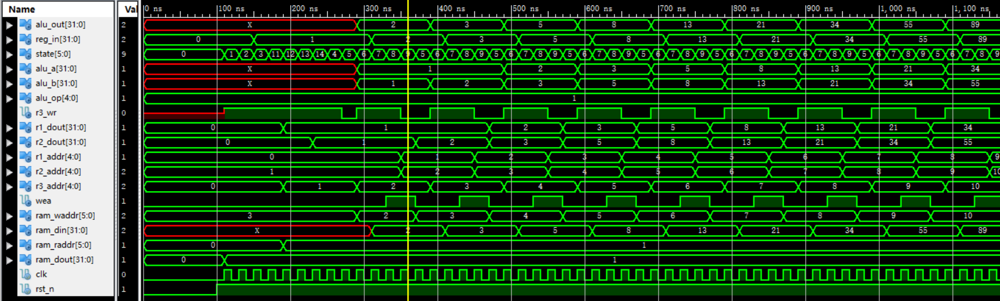

# Lab03 存储器RAM

> PB15000102 王嵩超

## 实验内容

- 学习使用ISE的IP核
- 学习使用Xilink FPGA内的RAM资源
  - 例化一个简单双端口的RAM (32bit x 64)
  - 使用coe文件对RAM进行初始化

## 实验功能要求

综合利用三次实验的结果，完成以下功能：

- 从ram中0地址和1地址读取两个数， 分别赋给reg0和reg1
- 利用第二次实验的结果(ALU+Regfile)进行斐波拉契运算，运算结果保存在对应的寄存器
- 运算结果同时保存在对应的ram地址中，即ram[0]<----->reg0, ram[1]<----->reg1, ram[2]<----->reg2,……

## 实验设计

- 实现一个control模块，完成整个运算的控制。

  control应包含RAM的输出、ALU的输出、寄存器堆的输出三者作为输入信号；输出信号作为RAM的控制、输入信号，ALU的输入信号、寄存器输入、使能信号。也可把内部的状态寄存器作为输出，方便调试。

- 实现一个顶层模块Top
  - 调用Ram模块
  - 调用RegFile
  - 调用ALU完成加法运算
  - 调用control模块，完成运算控制

  > 本实验接线较多，调用繁琐。在写top和control模块的调用时应格外仔细。因为漏写接口并不会导致报错！

- 加入仿真模块simu，对top模块进行仿真

## RAM的例化

主要参数如下，其他保持默认即可：


其中Write Width代表每个寄存器的宽度、Write Depth代表有多少个寄存器。

## 仿真结果



存储器：


寄存器：


## 总结

本实验状态数较多，主要是未多考虑存储器取数存数的性质，用大量周期来等待存储器的写入和读取，减慢了执行速度。

由于存储器在读地址变化后，会在时钟上升沿后的晚些时候才使输出变化，得在下一周期才能取得输出。

为了减少周期数，可采用以下几种办法：

1. 在状态机中精心安排信号的控制时间，尽量提前在操作前发出控制信号，做到在取数周期时，RAM的output端口已经有结果了。

2. 多采用组合逻辑，组合逻辑响应较快，不用等到下一个时钟周期才开始行动。

   > 本来按CPU的设计，很多接线（比如ALU与Reg、ALU与MEM两者的选择）都是组合逻辑，只需让状态机产生控制信号。但这几次实验为了方便，包括我在内很多人都把REG和MEM的输入端口设为寄存器，每次用时就手动将ALU_input赋给MEM或Reg，这样显然就迟钝很多。

3. 采用分频时钟。一种方式是让RAM响应时钟的上升沿和下降沿。上一周期改变地址，在上周期的后半时间就能使RAM读取，在下一周期就能取数。

## 源代码

### myreg.v

```verilog
//r1 r2 read; r3 write
module REG_FILE(
input			            clk,
input			            rst_n,
input	     [4:0]	    	r1_addr,
input	     [4:0]	      r2_addr,
input	     [4:0]	      r3_addr,
input	     [31:0]       r3_din,
input			            r3_wr,
output reg [31:0]	      r1_dout,
output reg [31:0]	      r2_dout
);

reg [31:0] R[31:0];
integer i;
always@(posedge clk,negedge rst_n)
begin
    if(~rst_n)
    begin
        for ( i=0; i<32; i=i+1 )  R[i] <= 0;
        r1_dout <=0;
        r2_dout <=0;
    end
    else
    begin
        r1_dout = R[r1_addr];
        r2_dout = R[r2_addr];
		  if(r3_wr) //write enabled
        R[r3_addr] = r3_din;
    end
end
endmodule

```

## ALU.v

```verilog
`timescale 1ns / 1ps
//////////////////////////////////////////////////////////////////////////////////
// Company: 
// Engineer: 
// 
// Create Date:    16:53:21 03/20/2017 
// Design Name: 
// Module Name:    ALU 
// Project Name: 
// Target Devices: 
// Tool versions: 
// Description: 
//
// Dependencies: 
//
// Revision: 
// Revision 0.01 - File Created
// Additional Comments: 
//
//////////////////////////////////////////////////////////////////////////////////
module ALU(
    input signed [31:0] alu_a,
    input signed [31:0] alu_b,
    input [4:0] alu_op,
    output reg [31:0] alu_out
    );
parameter A_NOP = 5'h00; //空运算  
parameter A_ADD = 5'h01; //符号加
parameter A_SUB = 5'h02; //符号减
parameter A_AND = 5'h03; //与
parameter A_OR  = 5'h04; //或
parameter A_XOR = 5'h05; //异或
parameter A_NOR = 5'h06; //或非

always@(*)
begin
    case(alu_op)
	 A_NOP:
	 begin
	     
	 end
	 A_ADD:
	 begin
	     alu_out <= alu_a + alu_b;
	 end
	 A_SUB:
	 begin
	     alu_out <= alu_a - alu_b;
	 end
	 A_AND:
	 begin
	     alu_out <= alu_a & alu_b;
	 end
	 A_OR:
	 begin
	     alu_out <= alu_a | alu_b;
	 end
	 A_XOR:
	 begin
	     alu_out <= alu_a ^| alu_b;
    end
	 A_NOR:
	 begin
	     alu_out <= ~(alu_a | alu_b);
	 end
	 endcase
end
endmodule

```

## control.v

```verilog
`timescale 1ns / 1ps
//////////////////////////////////////////////////////////////////////////////////
// Company: 
// Engineer: 
// 
// Create Date:    13:32:24 03/28/2017 
// Design Name: 
// Module Name:    control 
// Project Name: 
// Target Devices: 
// Tool versions: 
// Description: 
//
// Dependencies: 
//
// Revision: 
// Revision 0.01 - File Created
// Additional Comments: 
//
//////////////////////////////////////////////////////////////////////////////////
module control(
input clk, 
input rst_n, 
input [31:0] ram_dout, //from RAM
input [31:0] alu_out,
input [31:0]   r1_dout,
input [31:0]	r2_dout,

output reg [5:0] state, //no need to output, just made for convenience when debugging
output reg	[4:0]	    	      r1_addr,
output reg	[4:0]	            r2_addr,
output reg	[4:0]	            r3_addr,
output reg [31:0] alu_a,
output reg [31:0] alu_b,
output reg [4:0] alu_op,
output reg   r3_wr,

//for RAM
output reg wea,
output reg [5:0] ram_waddr,
output reg [31:0] ram_din,
output reg [5:0] ram_raddr,
output reg [31:0] reg_in
    );
//reg	[31:0]            r3_din; //substituted by alu_out.
//registers can only be set values via ALU.
    always@(posedge clk,negedge rst_n)
    begin
        if(~rst_n)
		  begin
        state <= 0;
		  r1_addr <= 0;
		  r2_addr <= 1;
		  r3_addr <= 0;
		  alu_op <= 5'h01;
		  //ram
		  ram_raddr <= 0;
		  reg_in <= 0;
		  ram_waddr <= 3;
		  wea <= 0;
		  end
        else
        begin
            case(state)
            0://initialize I R[0]=RAM[0]
            begin
					 r3_wr <= 1;
					 state <= 1;
            end
				1://waiting for MEM fetch
				begin
				    state <= 2;
				end
				2://assign to reg_in register
				begin
				    reg_in <= ram_dout;
					 state <= 3;
				end
				3://waiting for writing back
				begin
				    state <= 11;
				end
				11://initialize II R[1]=RAM[1]
				begin
				    r3_addr <= 1;
					 ram_raddr <= 1;
					 state <= 12;
				end
				12://waiting for MEM fetch
				begin
				    state <= 13;
				end
				13://assign to reg_in register
				begin
				    reg_in <= ram_dout;
					 state <= 14;
				end
				14://waiting for writing back
				begin
				    state <= 4;
				end
				4://turn off writing
				begin
				    r3_wr <= 0;
					 state <= 5;
				end
				5://before calculate
				begin
				    r3_addr <= r2_addr + 1; //adjust the writing port
					 ram_waddr <= r2_addr + 1;
					 r3_wr <= 1;//set write enable
					 
					 alu_a <= r1_dout; //R[n-1]
					 alu_b <= r2_dout; //R[n-2]
					 state <= 6;
				end
				6://calculating
				begin
				    reg_in <= alu_out;//this need to be delayed
					 ram_din <= alu_out;
				    state <= 7;
				end
				7://assign and judge
				begin
				    
					 wea <= 1; //set MEM write enable
					 if(r3_addr ==31) //reach the end
					 state <= 10;
					 else state <= 8;
				end
				8://move and wait when storing to MEM
				begin
				    r3_wr <= 0;
				    r1_addr <= r1_addr + 1;
					 r2_addr <= r2_addr + 1;
					 state <= 9;
				end
				9://waiting This is important, because r1_out and r2_out take time to output.
				begin
				    wea <= 0;
				    state <= 5;
					 ram_waddr <= ram_waddr + 1;
				end
				10://finish
				begin
				    state <= 10;
				end
				default:
				begin
				    state <= 0;
				end
            endcase
        end
    end
endmodule

```