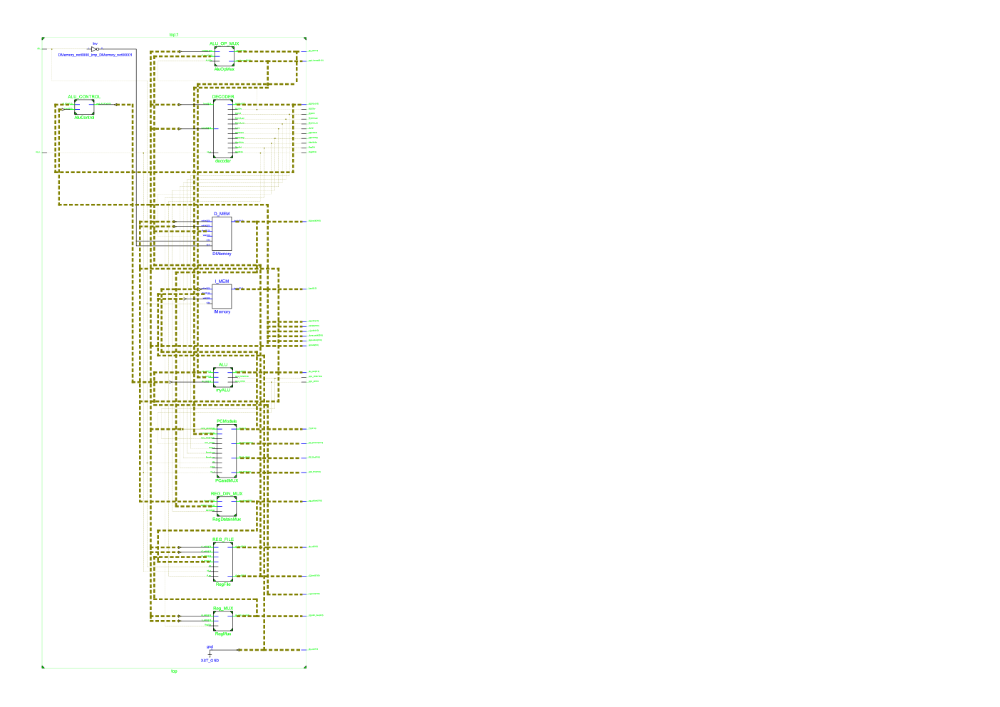

# Lab05 单周期CPU设计

> PB15000102 王嵩超

## 要求

涉及到两个ram，一个regfile，现在均要求是异步读，同步写。

故读写的时间约束不一样。应用双端口。这样就有clka和clkb。读端口clka连至addra，写端口clkb连至clk。

## 设计要点

- 异步读取模式。理想情况是：读取过程不受clk控制。即当addr变化之后，新的数据将在一定延时之后出现在输出端口。
  - 对于RegFile，实现异步读取只需要将always块写为always@(addr, negedge rst_n)即可。

    由于是同步写入。当前周期对RegFile的写入操作要在下一周期开始时才真正写入寄存器。这不影响下一周期的执行。

  - 对于I-MEM（指令寄存器），由于本实验未要求在运行时更改指令，其写使能可一直设为0。且在每条指令取指前的每个clk上升沿时刻，PC内容已经更新好，故不需要使用异步读取。

  - 而对于MEM，由于它们是由Block Memory Generator例化而来，很难直接实现addr变化后的立即响应。故本实验中，我将MEM的定时方式设为clk的下降沿。即在上半周期，准备好地址和各控制信号；下半周期MEM被触发执行。

    lw、sw指令在下半周期即可完成写入。

- bgtz在后来的MIPS指令集里不再是伪指令

  > 在MIPS的第一个版本中，bgtz由汇编器翻译为slt和bne两条指令的组合。后来则变为了一条操作码为7的机器指令

  实现方法：

  - 新增控制信号Branch_gz，并连入decoder、control模块
  - 给ALU增添输出标志：ALU_POSITIVE。当结果为正时该标志置1

  将Branch_gz和ALU_POSITIVE连入PC跳转单元，跳转单元将在两个信号同时为1时执行跳转。（整个思路和“为0则跳转”相同）

- PC跳转单元的实现

  在PCModule（管理PC下一周期的值的单元）中

  线网post_PC存有PC+1的结果。该结果不受任何条件而变化。

  各分支跳转信号的作用：（这些信号不可能同时出现）

  - Branch 当指令为BEQ时置位。I型指令的两操作数相等时跳转。判断两操作数是否相等，用ALU使用原有的减法功能，再利用ALU_ZERO即可实现。
  - Branch_ne的控制信号。当指令为BNE时置位。I型指令的两操作数不相等时跳转。ALU使用的功能同上。只是PCModule里根据控制信号的不同而有不同的逻辑（即与上相反的逻辑）。
  - Branch_gz BGTZ的控制信号。I型指令的rs操作数大于0时跳转。ALU使用加（或者减）操作，再利用ALU_POSITIVE实现判断。

  以上三条对PC进行更改的结果，将暂时放到线网PC_Branch上。若三个信号都未置位，则PC_Branch保持post_PC的值，若有置位的信号，PC_Branch=post_PC+Immed，逻辑表达式如下：

  ```verilog
  assign PC_Branch = ((Branch && ALU_ZERO)||(Branch_ne && !ALU_ZERO)||(Branch_gz && ALU_POSITIVE))?(post_PC+sext_Immed):post_PC;
  ```
  得到PC_Branch后，还不能作为下一时钟赋给PC的信号，因为还要考虑Jump指令。真正赋给PC的线网值如下：

  ```verilog
  assign PC_Src = Jump ? {post_PC[31:26],Jump_addr}:PC_Branch;
  ```

- MIPS地址是按一字节生成，而本实验地址按4字节生成

  解决方案有三：

  - 重新生成IP核，把位宽改为8。这将导致一次取址由4次操作完成，严重增加电路复杂度。
  - 更改MIPS指令，将地址操作数除以4
  - 用硬件实现，将原地址的最低两位砍掉，再接入MEM的输入端。显然这种方法更加统一和方便。

## 设计概要

### 总接线图

从上到下依次为ALU_OP_MUX（ALU操作数的选择器）、指令译码器、数据存储器、指令存储器、ALU、PC跳转单元、REG_DIN_MUX（寄存器写数据的选择器，来自MEM或ALU）、寄存器文件、REG_MUX（寄存器写地址的选择器，写入到rt或rd）。

> 可以看到有很多非必需的输出端口，这是为了便于调试。



### 仿真结果


最上面一条是指令内容。

PC每周期都显示的是下一周期指令的地址。

下面的各变量为各个部件的输入输出，和各种控制信号。

## 源代码

文件太多。源代码放在